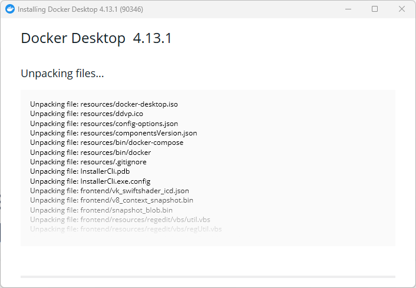

# Anleitung zur Installation von Docker, PostGIS und pgAdmin

1. Laden Sie [Docker Desktop](https://www.docker.com/products/docker-desktop/) für Ihr Betriebssystem herunter.  

2. Installieren Sie Docker Desktop auf Ihrem Rechner.  Im Laufe der Installation wird Ihr Rechner neu gestartet. 

3. Starten Sie Docker Desktop durch Doppelklick auf das Symbol auf dem Desktop.

4. Erstellen Sie ein Verzeichnis *Docker* auf Ihrem Desktop.

5. Laden Sie die Datei [docker-compose.yaml](https://raw.githubusercontent.com/LosWochos76/wbh_addons/main/IuK/docker-compose.yml) herunter und speichern Sie die Datei in dem zuvor erstellten Verzeichnis. Im Web-Browser können Sie dazu mit der rechten Maustaste auf den Inhalt klicken und "Speichern unter..." auswählen.

6. Öffnen Sie die Kommandozeile. Unter Windows 10/11 klicken Sie dazu den Start-Button und suchen nach "cmd".  Klicken Sie das  Programm "Eingabeaufforderung" an. Es öffnet sich ein neues Fenster mit schwarzem Hintergrund und einem weiß blinkenden Cursor. 

7. Wechseln Sie in das zuvor erstellte Verzeichnis. Dazu geben Sie den Befehl ```cd Desktop\Docker``` ein und bestätigen mit der Enter-Taste. Anschließend können Sie sich den Inhalt des aktuellen Verzeichnisses mit dem Befehl ```dir``` anzeigen. Das Ergebnis sollte wie folgt aussehen:  

8. Mitunter hat die Datei *docker-compose.yml* noch die Dateiendung ".txt". Dann müsste die Datei noch umbenannt werden. Dies geschieht auf der Kommandozeile mit dem Befehl:<br>
```ren docker-compose.yml.txt docker-compose.yml```.

9. Prüfen Sie, ob Docker Desktop gestartet ist. Der Kommandozeilenbefehl ```docker ps```sollte eine leere Liste ausgeben:  