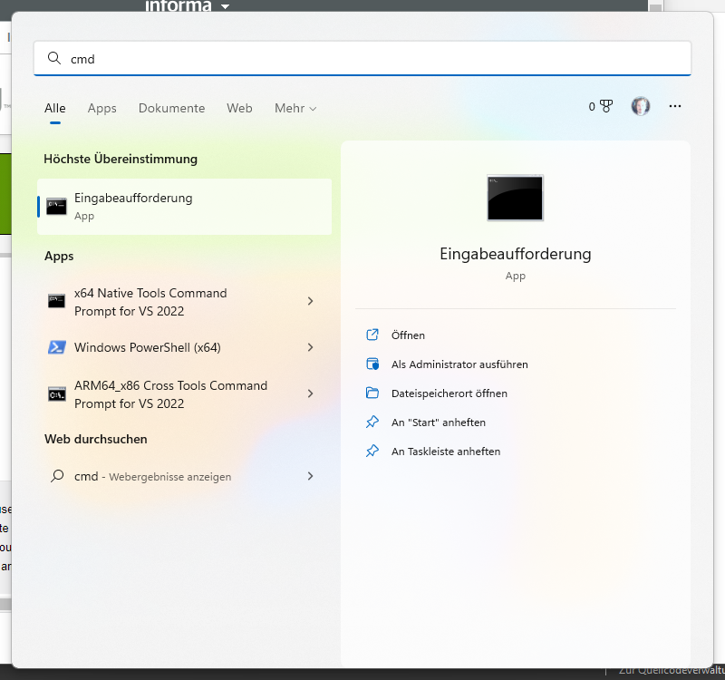
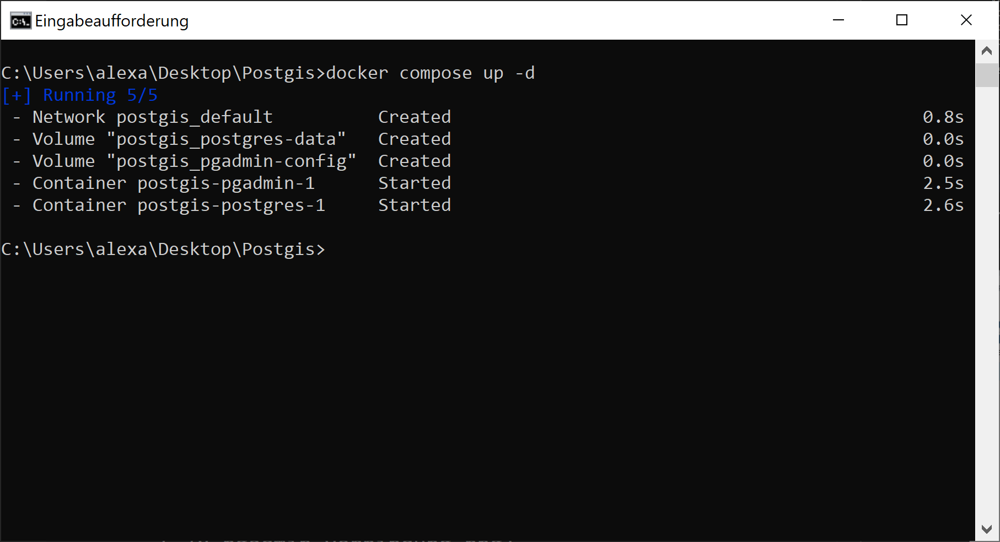

# Anleitung zur Installation von Docker, PostGIS und pgAdmin

1. Laden Sie [Docker Desktop](https://www.docker.com/products/docker-desktop/) für Ihr Betriebssystem herunter: <br>  

2. Installieren Sie Docker Desktop auf Ihrem Rechner: <br>  
<br> Im Laufe der Installation wird Ihr Rechner neu gestartet. 

3. Starten Sie Docker Desktop durch Doppelklick auf die Verknüpfung auf dem Desktop. Eventuell werden Sie aufgefordert, Komponten nachzuinstallieren. Folgen Sie diesen Anweisungen und starten dann den Rechner neu.

4. Erstellen Sie ein Verzeichnis *Docker* auf Ihrem Desktop.

5. Laden Sie die Datei [docker-compose.yaml](https://raw.githubusercontent.com/LosWochos76/wbh_addons/main/IuK/DockerInstallation/docker-compose.yml) herunter und speichern Sie die Datei in dem zuvor erstellten Verzeichnis. Im Web-Browser können Sie dazu mit der rechten Maustaste auf den Inhalt klicken und "Speichern unter..." auswählen.

6. Öffnen Sie die Kommandozeile. Unter Windows 10/11 klicken Sie dazu den Start-Button und suchen nach "cmd": <br>  <br> Klicken Sie das  Programm "Eingabeaufforderung" an. Es öffnet sich ein neues Fenster mit schwarzem Hintergrund und einem weiß blinkenden Cursor. 

7. Wechseln Sie in das zuvor erstellte Verzeichnis. Dazu geben Sie den Befehl ```cd Desktop\Docker``` ein und bestätigen mit der Enter-Taste. Anschließend können Sie sich den Inhalt des aktuellen Verzeichnisses mit dem Befehl ```dir``` anzeigen. Das Ergebnis sollte wie folgt aussehen: <br>  

8. Mitunter hat die Datei *docker-compose.yml* noch die Dateiendung ".txt". Dann müsste die Datei noch umbenannt werden. Dies geschieht auf der Kommandozeile mit dem Befehl:<br>
```ren docker-compose.yml.txt docker-compose.yml```.

9. Prüfen Sie, ob Docker Desktop gestartet ist. Der Kommandozeilenbefehl ```docker ps```sollte eine leere Liste ausgeben: <br> 

10. Starten Sie nun PostGIS und pgAdmin mit dem Befehl ```docker compose up -d```. Daraufhin werden zuerst einige Container heruntergeladen und anschließend gestartet: <br> 

11. In Ihrem Web-Broswer können Sie sich nun unter http://localhost:8080 in pgAdmin einloggen. Der Benutzername ist "admin@wb-fernstudium.de". Das Passwort lautet "secret". Das Ergebnis sollte wie folgt aussehen: <br> 

12. Beim ersten einloggen kennt pgAdmin noch keinen Datenbankserver. Dieser muss erst angelegt werden. Klicken Sie im Menü von pgAdmin dazu auf "Object --> Register --> Server". Geben Sie unter "Name" einen Namen ein,z.B. "postgres". Im Reiter "Connection" müssen einige Parameter eingetragen werden. Unter "Host" muss "postgres" eingetragen werden. Unter "Username" ebenfalls "postgres" und unter "Password" der Wert "secret". Das Ergebnis sollte wie folgt aussehen: <br> 

13. Nach dem Speichern der Verbindungsdaten sollte im linken Bereich des Fensters der neue Server zu sehen sein. Dazu kann man den Baum aufklappen und den Server anklicken. Im Menü von pgAdmin kann man nun unter das Query-Tool aufrufen "Tools --> Query Tool". In dem sich öffnenden Fenster kann man beliebige SQL-Befehle an die Datenbank absetzen. Die Datenbank ist nun einsatzbereit: <br> 

14. 
