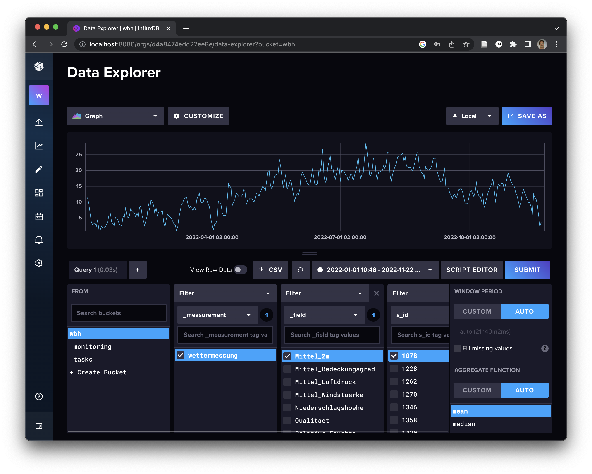

# Anleitung zum Import von Wetterdaten in die InfluxDB-Datenbank

1. Als Voraussetzung für den Import der Wetterdaten muss auf dem Rechner eine InfluxDB-Datenbank installiert sein und aktuell laufen. Wenn Sie zuvor die PostgreSQL-Datenbank installiert haben, ist diese ebenfalls bereits vorhanden, siehe [hier](https://github.com/LosWochos76/wbh_addons/blob/main/IuK/DockerInstallation/README.md). Unter (http://localhost:8086) kann die InfluxDB-Datenbank dann erreicht werden.

2. Erstellen Sie auf Ihrem Desktop ein neues Verzeichnis *Influx*.

3. Laden Sie die das Python-Script [import.py](https://raw.githubusercontent.com/LosWochos76/wbh_addons/main/IuK/Influx/import.py) herunter und speichern Sie es im zuvor erstellten Verzeichnis. Dafür können Sie im Browser mit der rechten Maustaste auf den Inhalt klicken und "Speichern unter..." auswählen.

4. Für die weiteren Schritte benötigen Sie eine Python-Umgebung auf Ihrem Rechner. Sollte diese bereits installiert sein, können Sie diesen Schritt überspringen. Laden Sie [Miniconda](https://docs.conda.io/en/latest/miniconda.html) für Ihr Betriebssystem herunter und installieren Sie es. Alle Voreinstellungen des Installationsassistenten können Sie auf den Standardwerten belassen.

5. Nach erfolgreicher Installation von Python können Sie im Startmenü von Windows das Wort "miniconda" eingeben. Es sollte dann der Eintrag "Miniconda Prompt" angezeigt werden. Durch Klicken auf den Eintrag öffnet sich ein Fenster mit schwarzem Hintergrund und weiß blinkendem Cursor.

6. Wechseln Sie in das Verzeichnis *Influx*. Dazu nutzen Sie den Befehl ```cd Desktop\Influx```. Zur Kontrolle können Sie sich den Inhalt des Verzeichnisses ansehen. Dies geschieht mit dem Befehl ```dir```.

7. Sollte die Datei *import.py* eine Dateiendung *.txt* besitzen, müssen Sie die Datei noch umbenennen. Die geschieht über den folgenden Befehl: ```ren import.py.txt import.py```

8. Nun müssen einige Python-Pakete installiert werden. Dazu müssen die folgenden Befehle eingegeben werden (die Reihenfolge ist dabei unwichtig):
- ```conda install -c anaconda pandas```
- ```conda install -c anaconda pywget```
- ```conda install -c conda-forge psycopg2```
- ```conda install -c conda-forge influxdb-client```
- ```conda install -c conda-forge progress```<br><br>
Rückfragen können mit "y" (yes) beantwortet werden.

9. Nun kann das eigentliche Import-Script gestartet werden. Dazu wird der folgende Befehl ausgeführt: ```python import.py```. Das Herunterladen und der Import in die Datenbank dauern eine Weile. 

10. Nach erfolgreichem Import der Daten kann man sich unter [http://localhost:8086] in die Web-Oberfläche der lokalen InfluxDB-Datenbank einloggen. Der Benutzername ist *wbh* und das Passwort ist *secretsercet*. Es sollte sich dann folgendes Bild ergeben: <br> 

11. In der linken Leiste klickt man bei dem Pfeil-Symbol auf den Menüpunkt *Buckets*. In der sich öffnenden Ansicht ist der Eintrag *wbh* zu finden. Dort sind die Wetterdaten abgelegt. Durch anklicken gelangt man zum *Data Explorer*, der u.a. die grafische Darstellung der Zeitreihendaten erlaubt. Im unteren Bereich kann man dazu eine Abfrage konfigurieren. Wichtig ist dabei, dass man einen Zeitraum auswählt, für den auch Daten importiert wurden, z.B. das letzte Jahr. Danach kann man die Zeitreihe *wettermessung* auswählen und bestimmte Kriterien, die einen interessieren, z.B. *Mittel_2m* für die gemittelte Tagestemperatur. Zuletzt muss noch eine Messstation ausgewählt werden. Die *S_ID* mit der Nummer 1078 steht dabei z.B. für Düsseldorf. Es ergibt sich dann z.B. das folgende Bild: <br> 
