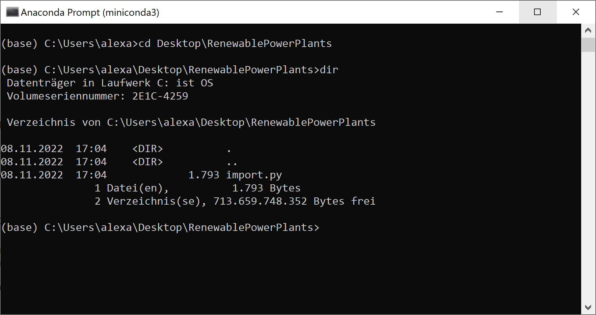
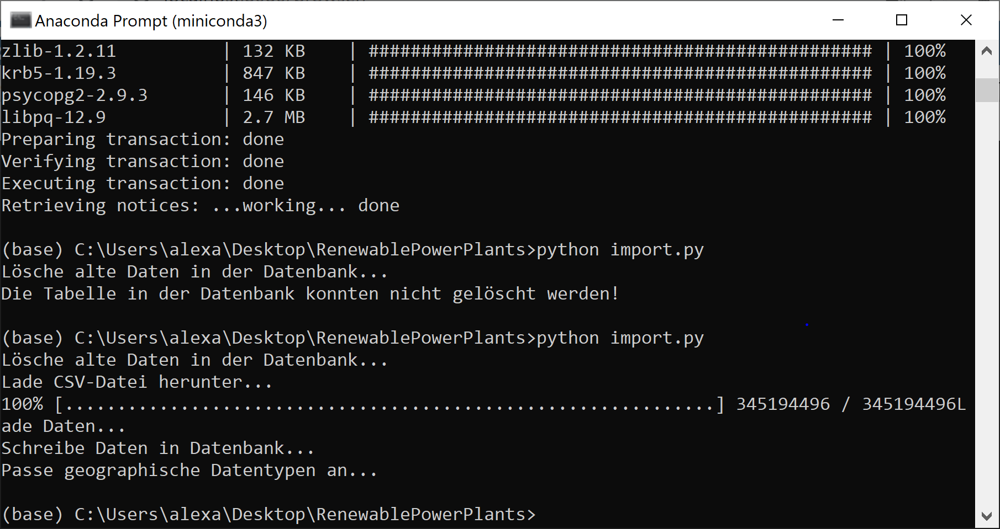
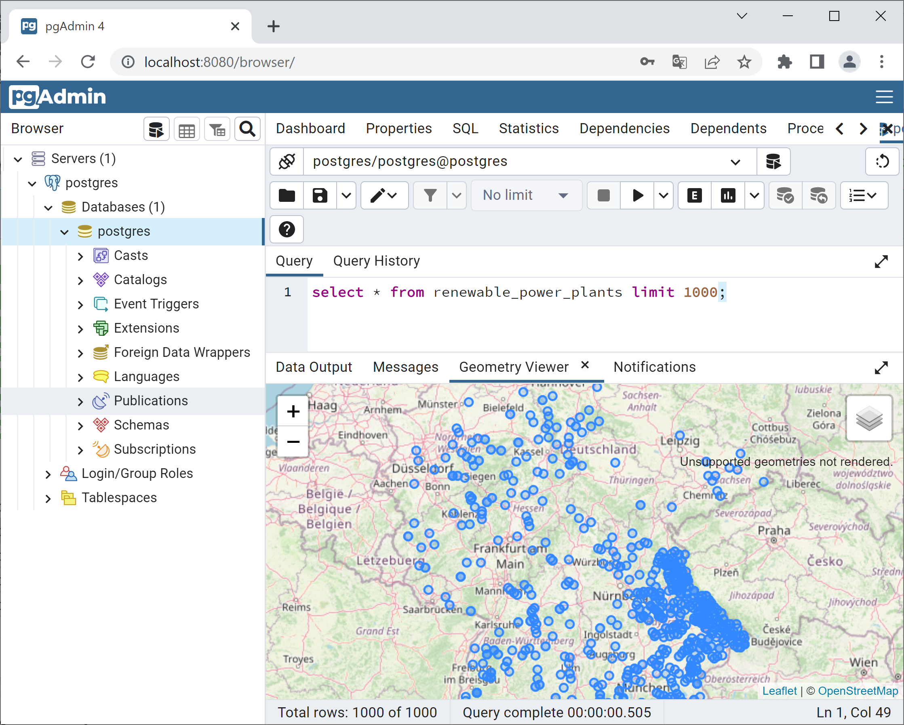

# Anleitung zum Import der EE-Anlagen in die PostGIS-Datenbank

1. Als Voraussetzung für diese Schritte muss auf dem Rechner eine PostGIS-Datenbank installiert sein und aktuell laufen. Eine Anleitung dazu finden Sie [hier](https://github.com/LosWochos76/wbh_addons/blob/main/IuK/DockerInstallation/README.md).

2. Erstellen Sie auf Ihrem Desktop ein neues Verzeichnis *RenewablePowerPlants*.

3. Laden Sie die das Python-Script [import.py](https://raw.githubusercontent.com/LosWochos76/wbh_addons/main/IuK/RenewablePowerPlants/import.py) herunter und speichern Sie es im zuvor erstellten Verzeichnis. Dafür können Sie im Browser mit der rechten Maustaste auf den Inhalt klicken und "Speichern unter..." auswählen.

2. Für die weiteren Schritte benötigen Sie eine Python-Umgebung auf Ihrem Rechner. Im folgenden wird davon ausgegangen, dass diese noch nicht installiert ist. Laden Sie dazu [Miniconda](https://docs.conda.io/en/latest/miniconda.html) für Ihr Betriebssystem herunter und installieren das Paket. Alle Voreinstellungen des Installationsassistenten können Sie auf den Standardwerten belassen.

3. Nach erfolgreicher Installation von Python können Sie im Startmenü von Windows das Wort "miniconda" eingeben. Es sollte dann der Eintrag "Miniconda Prompt" angezeigt werden. Durch Klicken auf den Eintrag öffnet sich ein Fenster mit schwarzem Hintergrund und weiß blinkendem Cursor.

4. Wechseln Sie in das Verzeichnis *RenewablePowerPlants*. Dazu nutzen Sie den Befehl ```cd Desktop\RenewablePowerPlants```. Zur Kontrolle können Sie sich den Inhalt des Verzeichnisses ansehen. Dies geschieht mit dem Befehl ```dir```. Das Ergebnis sollte wie folgt aussehen: <br> 

5. Sollte die Datei *import.py* eine Dateiendung *.txt* besitzen, müssen Sie die Datei noch umbenennen. Die geschieht über den folgenden Befehl: ```ren import.py.txt import.py```

6. Nun müssen einige Python-Pakete installiert werden. Dazu müssen die folgenden Befehle eingegeben werden (die Reihenfolge ist dabei unwichtig):
- ```conda install -c anaconda pandas```
- ```conda install -c anaconda sqlalchemy```
- ```conda install -c anaconda pywget```
- ```conda install -c conda-forge psycopg2```<br><br>
Rückfragen können mit "y" (yes) beantwortet werden.

7. Nun kann das eigentliche Import-Script gestartet werden. Dazu wird der folgende Befehl ausgeführt: ```python import.py```. Das Herunterladen von knapp 300MB an Daten und der Import in die Datenbank dauern eine Weile. Nach erfolgreicher Ausführung sollte sich folgendes Bild ergeben: <br> 

8. Die Daten sind nun in die Datenbank importiert. In pgAdmin kann man eine entsprechende SQL-Abfrage absetzen. Mithilfe des Query-Tools kann man z.B. die ersten 1000 Erzeugungsanlagen anzeigen: ```select * from renewable_power_plants limit 1000;```. Das Ergebnis ist eine Tabelle mit Erzeugungseinheiten. Die Spalte *loc* enthält die Standorte der Anlagen. Ein Klick auf das Icon in der Spaltenüberschrift zeigt die Daten in einer Landkarte an. Es ergibt sich dann folgendes Bild: 